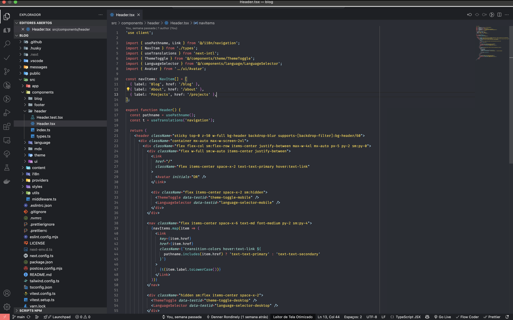
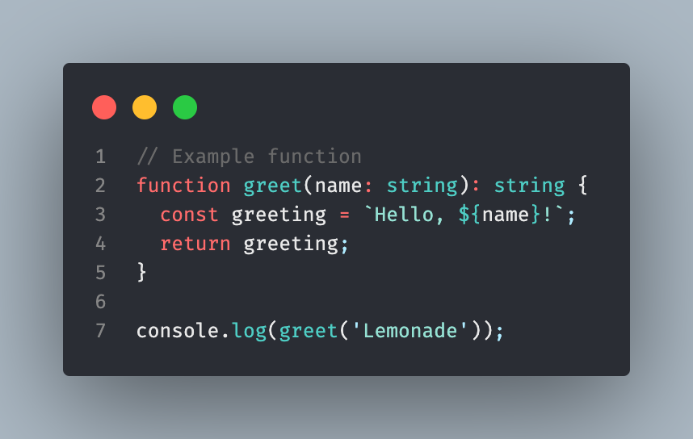
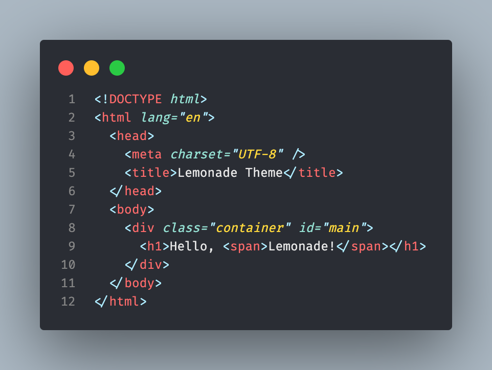
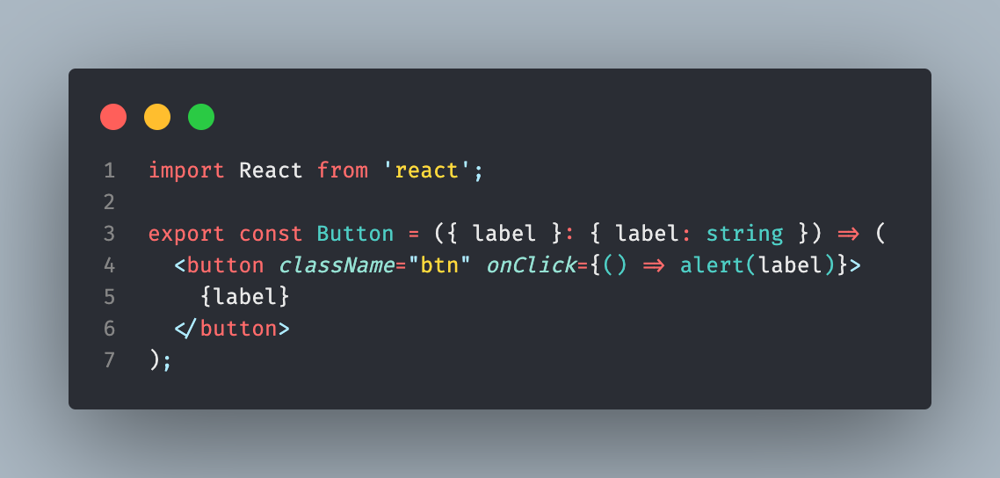
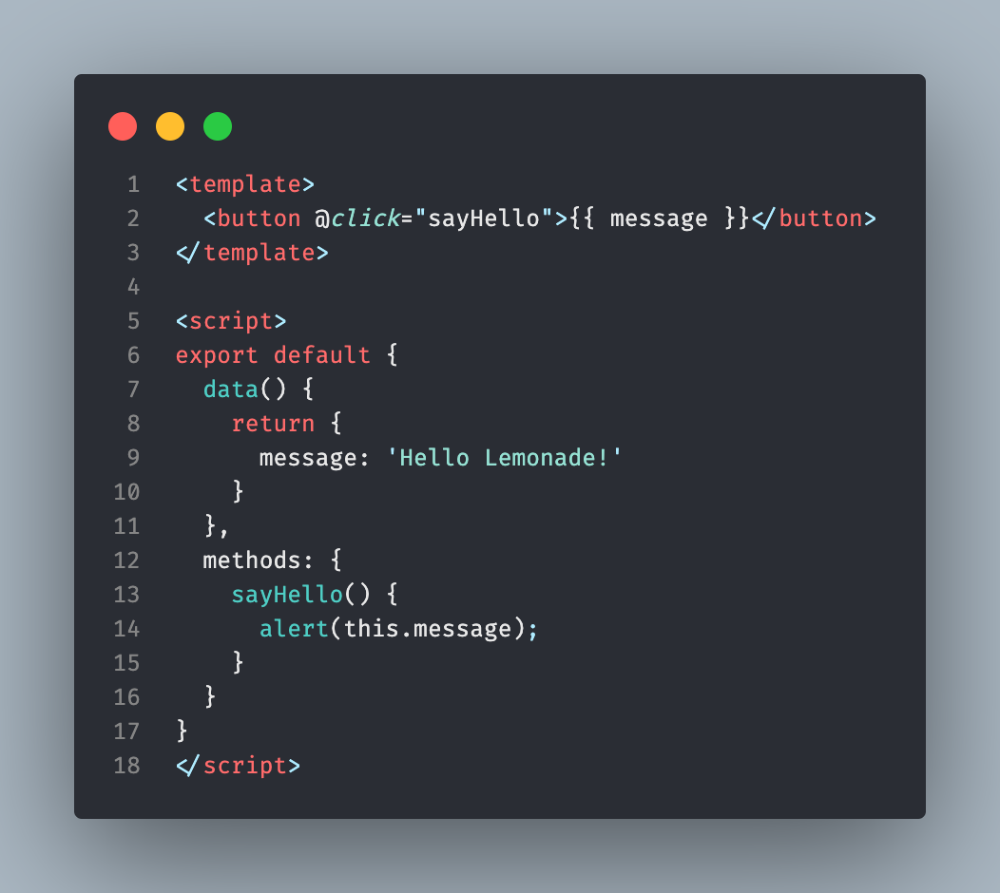
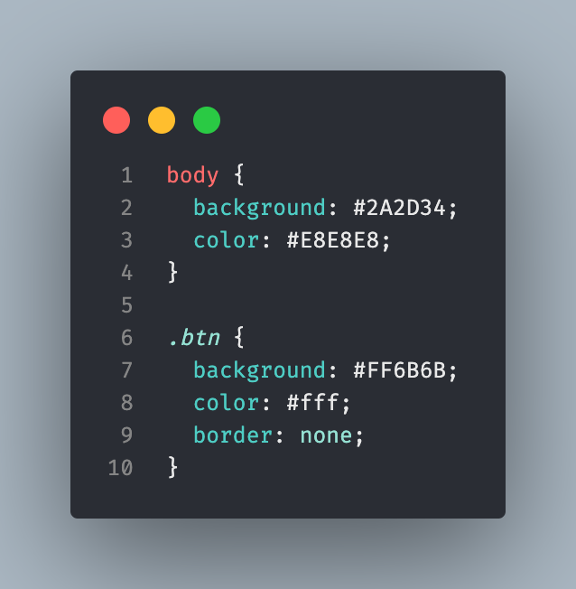
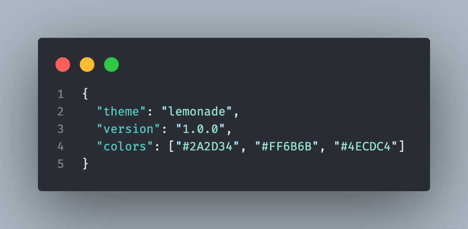
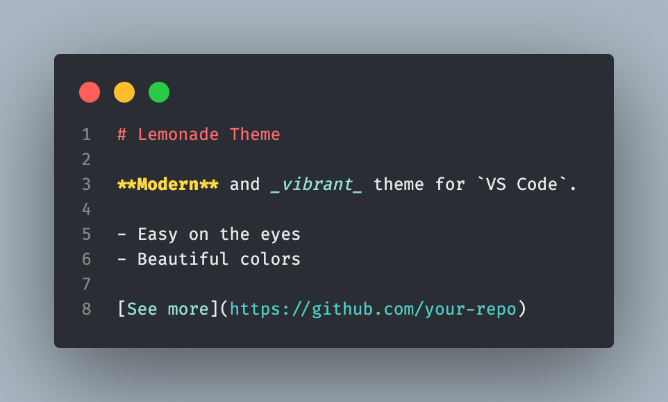
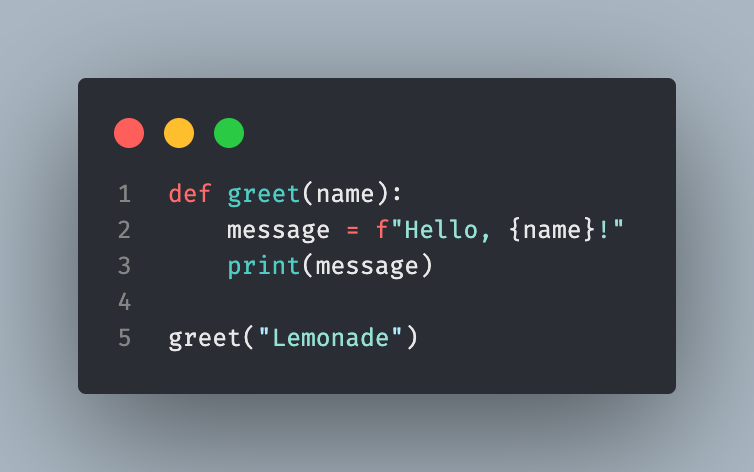

# 🍋 Lemonade Theme for VS Code

A modern, vibrant, and readable dark theme for Visual Studio Code, inspired by Atom Material but with a unique color palette and fresh highlights. Lemonade is designed for developers who want clarity, contrast, and a touch of fun in their code editor.

## Features

- **Modern dark base**: Built on #2A2D34 for a sleek, comfortable look
- **Unique color palette**: Carefully selected colors for code, UI, and terminal
- **Distinct highlights**: Special colors for tag delimiters, quotes, semicolons, and more
- **Full language support**: Works great with JavaScript, TypeScript, HTML, CSS, JSX, TSX, Vue, Python, JSON, Markdown, and more
- **Accessible and readable**: High contrast for easy reading and reduced eye strain
- **Beautiful terminal colors**

## Color Palette

| Element                | Color      | Example         |
|------------------------|------------|-----------------|
| Background             | #2A2D34    |                 |
| Foreground/Text        | #E8E8E8    |                 |
| Accent (Red/Coral)     | #FF6B6B    | Tags, keywords  |
| Accent (Turquoise)     | #4ECDC4    | Functions, types|
| Accent (Mint)          | #95E1D3    | Strings, attrs  |
| Accent (Yellow)        | #FFD93D    | Numbers, bold   |
| Tag Delimiters/Quotes  | #AEEBFF    | < > " ' ;       |
| Comments               | #6A6A6A    |                 |
| UI Darker              | #1E2024    |                 |

## Example

## Code Samples

Below are screenshots of Lemonade highlighting various languages:

**JavaScript / TypeScript**

**HTML**

**JSX / TSX**

**Vue**

**CSS**

**JSON**

**Markdown**

**Python**

## Installation

1. **Clone or download this repository**
2. Open the folder in VS Code
3. Run `npm install` to install dependencies
4. Press `F5` to open a new Extension Development Host window
5. Open the Command Palette (`Ctrl+Shift+P` or `Cmd+Shift+P`)
6. Type `Color Theme` and select `Lemonade`

Or, after packaging:

1. Run `npm run package` to create a `.vsix` file
2. Install it in VS Code: `code --install-extension lemonade-theme-x.x.x.vsix`

## Custom Highlights

- **Tag delimiters** (`<`, `>`, `</`, `/>`): Blue highlight for easy reading
- **Quotes** (`'`, `"`): Blue highlight for string boundaries
- **Semicolons** (`;`): Blue highlight for statement ends
- **HTML/JSX/Vue attributes**: Mint italic for attributes, yellow for values
- **Vue directives**: Mint bold
- **Markdown, JSON, CSS, and more**: Carefully tuned for clarity

## Contributing

Pull requests are welcome! If you have suggestions for improvements, new language support, or spot any issues, feel free to open an issue or PR.

## License

MIT License. See the [LICENSE](LICENSE) file for details. 